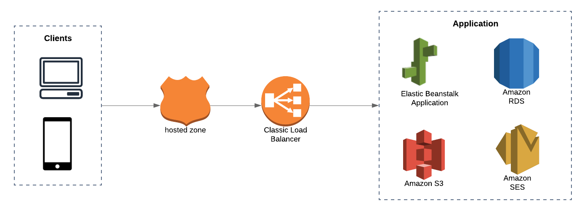
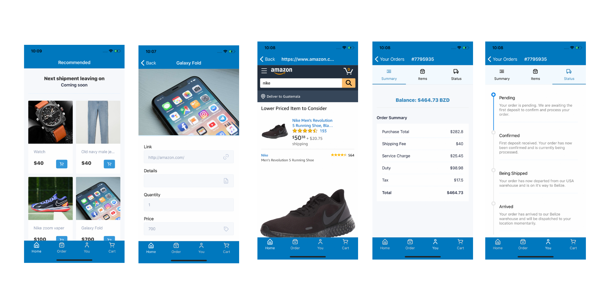

For this project the client was only able to convey the initial idea, nothing concrete was given – just an idea. As such I had to take the initiative to plan out most of the features for both web and mobile platforms.

\
&nbsp;

## Problem Statement

Shopping and shipping from the US to Belize has always been a confusing and inefficient process, most of the time being impractical for most Belizeans.

\
&nbsp;

## Solution

An intuitive and modern experience driven by two platforms – web and mobile. A platform that encompasses all the most vital features essential to any international shopping and shipping service:

### Link submissions

### Catalog ordering

### Order estimation

### Order tracking

### Invoices/receipts

### Order updates (email & push notifications)

### Customer dashboard

### Admin dashboard

### And much more…

\
&nbsp;

## Project structure & architecture

The project’s code base was divided into four parts:
API (Rails) + Website (Rails & React) + Android app (React Native) + iOS app (React Native)

AWS has now become my goto provider for all things cloud computing. Goodbye DigitalOcean and Heroku.

I used a variety of AWS services to host this application. The diagram below illustrates the main ones I utilised. One service that I want to highlight is AWS CloudFormation. In short this is a tool that enables you to define your infrastructure via code. I used this tool to setup all the provisioning you see below. It is a must have for me for the mere fact that it eliminates a lot of redundancy and saves time. I highly recommend you take a look at it.

In the old days when I was just learning how to setup a VPS I would manually install the system tools, system libraries and settings. Good for learning but it gets repetitive.

More recently, I’ve started using Elastic BeanStalk to deploy and manage my web applications. This eliminates the need for me having to SSH into the server and manually setting the stage. It’s also makes deployment a walk in the park.

## Killing two birds with one stone

Thanks to react native I was able to quickly develop a prototype of not only the iOS app, but of the android app as well. Being a one man band made it impractical for me to develop for both platforms using their native SDKS.

I still have it down as a goal of mine to one day develop and app using its native SDK. But for this project, react native was a no brainer.

\
&nbsp

## Conclusion

This was a very challenging project to work on mostly for the fact that I was the only one working on it. As such I had to make some tradeoffs, some of which I’m not too proud of.

The main one being the overall test coverage of the codebase. The mobile app has literally zero test coverage and for the API I only tested the critical parts such as invoice generation, order estimation, and email delivery.

Apart from that, the website itself is production ready while the mobile apps are pending reviewal from their respective stores.
